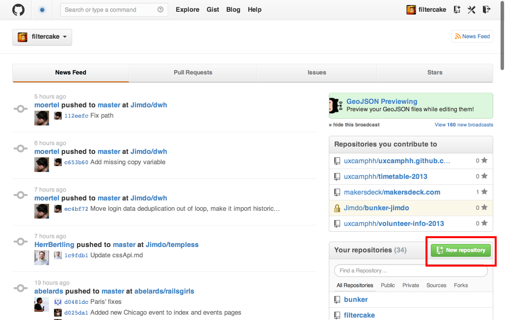
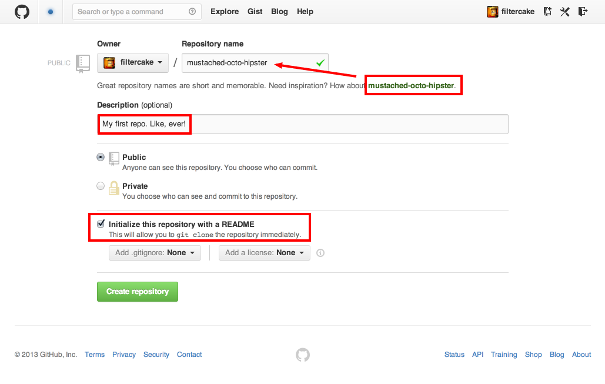
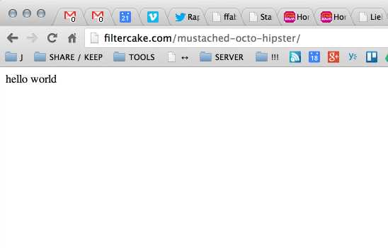

# H1 HEADLINE Headline

## H2 HEADLINE Headline

### H3 HEADLINE Headline

#### H4 HEADLINE Headline

Normal text

<section class="full" data-background="/images/kitten.jpeg">
full screen image

<section class="full" data-background="/images/kitten.jpeg">

<h1>Github From Scratch</h1>

A workshop by [@filtercake](https://twitter.com/filtercake)

for the [OpenTechSchool Hamburg](http://www.meetup.com/opentechschool-hamburg/).

[CC BY-NC-SA](https://creativecommons.org/licenses/by-nc-sa/3.0/)

</section>

<!-- 
fade-in
 -->

# Make a new repository
## Call it (something)

# Create a file
`index.html`

# Goto your-username.github.io

Note:
# hello notes
yes, there is **markdown** in the notes *too*!